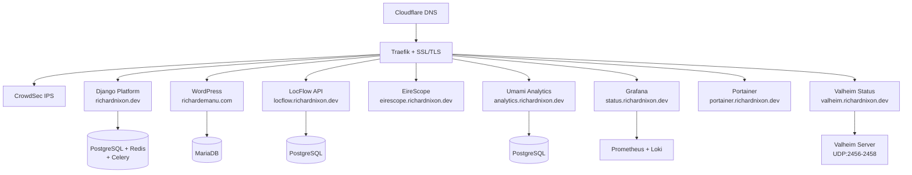

# richardnixon.dev

Personal portfolio and blog platform built with Django, deployed with Docker.

## Architecture



## Services

| Service | Domain | Description |
|---------|--------|-------------|
| Django Platform | richardnixon.dev | Blog, portfolio, contact |
| WordPress | richardemanu.com | Personal site |
| LocFlow | locflow.richardnixon.dev | Localization automation platform (REST API) |
| EireScope | eirescope.richardnixon.dev | OSINT dashboard |
| Umami | analytics.richardnixon.dev | Privacy-focused analytics |
| Grafana | status.richardnixon.dev | Observability dashboards |
| Portainer | portainer.richardnixon.dev | Docker management |
| Valheim Status | valheim.richardnixon.dev | Game server status page |
| Valheim Server | valheim.richardnixon.dev:2456 | Valheim dedicated server |

## Technology Stack

### Application
- **Backend**: Django 5.x, Celery, PostgreSQL 16, Redis 7
- **Frontend**: Django Templates, HTMX, TailwindCSS
- **Auth**: django-allauth (Google/GitHub OAuth), django-two-factor-auth (2FA)
- **i18n**: English + Portuguese (django-modeltranslation)

### Infrastructure
- **Reverse Proxy**: Traefik v3 with Let's Encrypt SSL
- **Containers**: Docker Compose
- **Monitoring**: Prometheus, Grafana, Loki, Promtail, cAdvisor
- **Exporters**: Node Exporter, PostgreSQL Exporter, Redis Exporter

### Security
- **CrowdSec**: IPS with community threat intelligence + Traefik bouncer
- **Fail2ban**: SSH brute-force protection (3 attempts = 24h ban)
- **GeoIP Blocking**: Country-based filtering for SSH
- **reCAPTCHA v3**: Contact form spam protection

## Grafana Dashboards

| Dashboard | Description |
|-----------|-------------|
| VPS System | CPU, memory, disk, load average, uptime |
| CrowdSec Security | Active bans, alerts, attack types |
| Traefik Proxy | Requests/s, latency, status codes |
| Database | PostgreSQL and Redis metrics |
| Network & Firewall | Bandwidth, TCP connections, security events |
| Container Logs | Real-time log viewer with search |
| Valheim Server | Players online, server status, resource usage |

## Prometheus Metrics

| Job | Target | Metrics |
|-----|--------|---------|
| prometheus | localhost:9090 | Prometheus self-metrics |
| cadvisor | cadvisor:8080 | Container metrics |
| traefik | traefik:8080 | HTTP requests, latency |
| node | node-exporter:9100 | VPS system metrics |
| postgres | postgres-exporter:9187 | PostgreSQL stats |
| redis | redis-exporter:9121 | Redis stats |
| crowdsec | crowdsec:6060 | Security metrics |
| valheim | valheim-metrics:3903 | Game server metrics |

## Project Structure

```
richardnixon.dev/
├── apps/
│   ├── accounts/       # Custom user model (email-based)
│   ├── blog/           # Blog posts, Markdown, RSS
│   ├── portfolio/      # Projects showcase
│   └── contact/        # Contact form with reCAPTCHA
├── config/
│   ├── settings/
│   │   ├── base.py
│   │   ├── development.py
│   │   └── production.py
│   ├── urls.py
│   ├── celery.py
│   └── wsgi.py
├── templates/
├── static/
├── locale/             # i18n translations
├── docker/
│   ├── Dockerfile
│   └── Dockerfile.full
└── infrastructure/
    ├── docker-compose.yml
    ├── .env.example
    ├── traefik/
    ├── prometheus/
    ├── loki/
    ├── promtail/
    ├── grafana/
    │   └── provisioning/
    │       ├── datasources/
    │       └── dashboards/
    ├── crowdsec/
    └── valheim-status/
```

## Quick Start

### Prerequisites
- Docker and Docker Compose
- Domain with DNS configured

### Deployment

1. Clone the repository:
```bash
git clone https://github.com/richardnixondev/richardnixon.dev.git
cd richardnixon.dev/infrastructure
```

2. Create environment file:
```bash
cp .env.example .env
# Edit .env with your credentials
```

3. Start services:
```bash
docker compose up -d
```

4. Run migrations:
```bash
docker compose exec platform-web python manage.py migrate
docker compose exec platform-web python manage.py createsuperuser
```

## Environment Variables

See `infrastructure/.env.example` for all required variables:

### Django
| Variable | Description |
|----------|-------------|
| `DJANGO_SECRET_KEY` | Django secret key |
| `PLATFORM_DB_PASSWORD` | PostgreSQL password |
| `DJANGO_SUPERUSER_EMAIL` | Admin email (optional) |
| `RECAPTCHA_PUBLIC_KEY` | reCAPTCHA v3 site key |
| `RECAPTCHA_PRIVATE_KEY` | reCAPTCHA v3 secret key |

### Monitoring
| Variable | Description |
|----------|-------------|
| `GRAFANA_ADMIN_PASSWORD` | Grafana admin password |
| `CROWDSEC_BOUNCER_KEY` | CrowdSec bouncer API key |

### LocFlow
| Variable | Description |
|----------|-------------|
| `LOCFLOW_DB_PASSWORD` | LocFlow PostgreSQL password |
| `LOCFLOW_SECRET_KEY` | LocFlow Django secret key |
| `LOCFLOW_UMAMI_WEBSITE_ID` | Umami website ID for tracking |

### EireScope
| Variable | Description |
|----------|-------------|
| `EIRESCOPE_SECRET_KEY` | EireScope secret key |
| `EIRESCOPE_UMAMI_WEBSITE_ID` | Umami website ID for tracking |

### Valheim
| Variable | Description |
|----------|-------------|
| `VALHEIM_PASSWORD` | Server password |
| `ADMINLIST_IDS` | Comma-separated Steam IDs of admins |
| `PERMITTEDLIST_IDS` | Comma-separated Steam IDs for whitelist |

## Security Configuration

### CrowdSec

Installed collections:
- `crowdsecurity/traefik` - Web attack detection
- `crowdsecurity/http-cve` - CVE exploit detection
- `crowdsecurity/linux` - Linux system protection
- `crowdsecurity/whitelist-good-actors` - CDN/bot whitelist

Country blocks (web traffic):
- Russia (RU), China (CN), North Korea (KP), Iran (IR), Ukraine (UA)

Useful commands:
```bash
# View metrics
docker exec crowdsec cscli metrics

# List active bans
docker exec crowdsec cscli decisions list

# Add manual ban
docker exec crowdsec cscli decisions add --ip 1.2.3.4 --duration 24h --reason "manual"

# View alerts
docker exec crowdsec cscli alerts list
```

### SSH Security

| Protection | Configuration |
|------------|---------------|
| Fail2ban | 3 attempts = 24h ban |
| GeoIP | Country-based filtering |
| CrowdSec | SSH brute-force detection |

## Valheim Server

### Configuration

| Setting | Value |
|---------|-------|
| Server Name | Emerald Realms |
| World Name | EmeraldRealms |
| Ports | UDP 2456-2458 |
| Backups | Every 12 hours, 7 days retention |
| Status Page | valheim.richardnixon.dev |

### Status Page Features

- Server online/offline indicator
- Players online count with connection duration
- World name and game version
- Server uptime
- Copy-to-clipboard server address

### Admin Commands (F5 console in-game)

```
kick [name/steamID]   - Kick player
ban [name/steamID]    - Ban player
unban [steamID]       - Unban player
banned                - List banned players
save                  - Force world save
info                  - Server info
```

### Managing Admins

Add Steam IDs to docker-compose.yml:
```yaml
ADMINLIST_IDS: "76561198012345678,76561198087654321"
PERMITTEDLIST_IDS: "76561198012345678,76561198087654321"
```

Then restart the server:
```bash
docker compose up -d valheim --force-recreate
```

## Monitoring

### Grafana Access

URL: https://status.richardnixon.dev

### Log Aggregation

Loki + Promtail collect logs from:
- All Docker containers
- System logs (/var/log)

Query logs in Grafana:
```
{container_name="platform-web"} |~ "error"
{job="docker"} |= "blocked"
```

## Common Commands

### Docker Management
```bash
# Start all services
docker compose up -d

# View container status
docker compose ps

# View logs
docker compose logs -f platform-web
docker compose logs -f platform-celery
docker compose logs -f locflow-web

# Rebuild after code changes
docker compose build platform-web platform-celery platform-celery-beat
docker compose up -d platform-web platform-celery platform-celery-beat

# Rebuild LocFlow
docker compose build locflow-web
docker compose up -d locflow-web

# Rebuild EireScope
docker compose build eirescope
docker compose up -d eirescope
```

### Django Management (Platform)
```bash
docker compose exec platform-web python manage.py migrate
docker compose exec platform-web python manage.py makemigrations
docker compose exec platform-web python manage.py createsuperuser
docker compose exec platform-web python manage.py collectstatic
docker compose exec platform-web python manage.py shell
```

### Django Management (LocFlow)
```bash
docker compose exec locflow-web python manage.py migrate
docker compose exec locflow-web python manage.py createsuperuser
docker compose exec locflow-web python manage.py shell
```

### Security Management
```bash
# Check fail2ban status
fail2ban-client status sshd

# View CrowdSec decisions
docker exec crowdsec cscli decisions list

# View iptables rules
iptables -L INPUT -n -v
```

### Valheim Management
```bash
# View server logs
docker compose logs -f valheim

# Restart server
docker compose restart valheim

# Backup world manually
docker exec valheim backup

# Check connected players
docker logs valheim 2>&1 | grep "Got connection"
```

## URL Routes

| Path | Description |
|------|-------------|
| `/` | Blog home |
| `/admin/` | Django admin (2FA enabled) |
| `/accounts/` | Authentication (OAuth) |
| `/portfolio/` | Projects showcase |
| `/contact/` | Contact form (reCAPTCHA) |
| `/sitemap.xml` | XML sitemap |
| `/feed/` | RSS feed |

## License

MIT License
